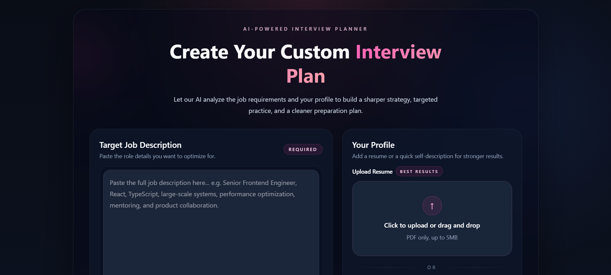
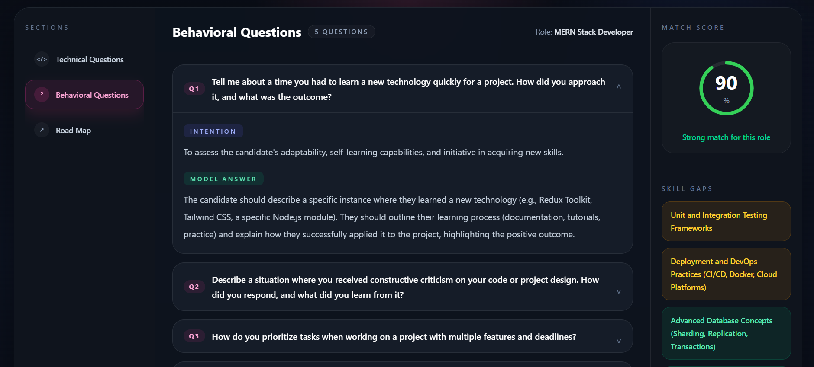

# Resume Shortner - AI-Powered Interview Preparation Platform

An intelligent platform that analyzes your resume and job descriptions to generate personalized interview preparation strategies powered by AI.

## 📋 Table of Contents

- [Overview](#overview)
- [Features](#features)
- [Tech Stack](#tech-stack)
- [Project Structure](#project-structure)
- [Installation](#installation)
- [Usage](#usage)
- [API Endpoints](#api-endpoints)
- [Screenshots](#screenshots)

## 🎯 Overview

Resume Shortner is an AI-powered interview preparation platform that helps job seekers prepare for interviews by analyzing their resume and the target job description. The platform generates:

- **Technical Questions** - Role-specific technical interview questions with model answers
- **Behavioral Questions** - Situational questions to assess soft skills
- **Preparation Plan** - Day-by-day structured learning roadmap
- **Skill Gaps Analysis** - Identification of missing skills with severity levels
- **Match Score** - Overall compatibility score with the target role

## ✨ Features

### Core Features
- 📝 **Resume Analysis** - Upload PDF resume for intelligent analysis
- 🎯 **Job Matching** - Paste job descriptions for role-specific preparation
- 🤖 **AI-Generated Content** - Machine learning-powered question and answer generation
- 📊 **Match Scoring** - Automatic compatibility scoring between resume and role
- 📋 **Interview Questions** - Comprehensive technical and behavioral question sets
- 🗓️ **Preparation Timeline** - Structured day-by-day preparation plan
- 📥 **Resume Download** - Export your analysis as a PDF document
- 💾 **Report History** - View and access all previous interview reports

### User Features
- 🔐 **User Authentication** - Secure login and registration
- 👤 **User Profile** - Manage your account and reports
- 📱 **Responsive Design** - Works seamlessly on desktop and mobile
- ⚡ **Real-time Loading** - Fast, responsive UI with smooth transitions

## 🛠️ Tech Stack

### Frontend
- **React 18** - UI library
- **Vite** - Build tool and dev server
- **Tailwind CSS** - Utility-first CSS framework
- **Axios** - HTTP client for API calls
- **React Router** - Client-side routing

### Backend
- **Node.js** - JavaScript runtime
- **Express.js** - Web framework
- **MongoDB** - NoSQL database
- **Mongoose** - MongoDB ODM
- **JWT** - Authentication tokens
- **Multer** - File upload middleware
- **PDF Parse** - PDF processing

### AI/Services
- **AI Service** - Integration for interview content generation

## 🚀 Installation

### Prerequisites
- Node.js (v14 or higher)
- npm or yarn package manager
- MongoDB instance (local or cloud)

### Frontend Setup

1. Navigate to the client directory:
```bash
cd client
```

2. Install dependencies:
```bash
npm install
```

3. Start the development server:
```bash
npm run dev
```

The client will be available at `http://localhost:5173`

### Backend Setup

1. Navigate to the server directory:
```bash
cd server
```

2. Install dependencies:
```bash
npm install
```

3. Start the development server:
```bash
npm run dev
```


## 💻 Usage

### For Users

1. **Sign Up / Login**
   - Create a new account or log in with existing credentials

2. **Create Interview Strategy**
   - Paste the job description you're targeting
   - Upload your resume (PDF) or write a self-description
   - Click "Generate My Interview Strategy"

3. **View Results**
   - Review technical and behavioral questions
   - Check your match score with the role
   - View identified skill gaps
   - Access your personalized preparation plan

4. **Download Resume**
   - Navigate to any interview report
   - Click "Download Resume PDF" button
   - Your analysis will be saved as a PDF

5. **Access History**
   - View all your previous reports on the home page
   - Click any report to continue preparation

### Key Pages

- **Home Page** (`/`)
  - Generate new interview strategy
  - View recent reports
  - Quick access to previous analyses

- **Interview Page** (`/interview/:interviewId`)
  - View detailed interview report
  - Browse technical questions
  - Check behavioral questions
  - Review preparation plan
  - Download PDF resume

- **Login Page** (`/auth/login`)
  - User authentication

- **Register Page** (`/auth/register`)
  - New user registration


### Dashboard / Home Page


### Interview Report Page


##  Security Features

- JWT-based authentication
- Password hashing with bcryptjs
- CORS protection
- File upload validation
- User data isolation
- Secure API endpoints with authentication middleware

## 📦 Features Workflow

### Interview Generation Flow
1. User submits job description + resume/profile
2. Resume PDF is parsed and extracted
3. AI service processes information
4. Interview questions are generated
5. Skill gaps are identified
6. Preparation plan is created
7. Report is saved to database
8. User is redirected to interview page

### Report Access Flow
1. User views recent reports on home page
2. Clicking a report fetches full details
3. Interview page loads with all questions and plan
4. User can download PDF version anytime

## 🚀 Future Enhancements

- Video recording for practice answers
- Interactive mock interview sessions
- Progress tracking and analytics
- Email notifications for interview tips
- Interview scheduling features
- Peer comparison and benchmarking
- Mobile app version
- Multi-language support

## 📝 License

This project is licensed under the MIT License.

## 🤝 Contributing

Contributions are welcome! Please feel free to submit a Pull Request.

## 📧 Support

For support or questions, please reach out through the project's issue tracker.

---

**Built with ❤️ for Resume shortner**
